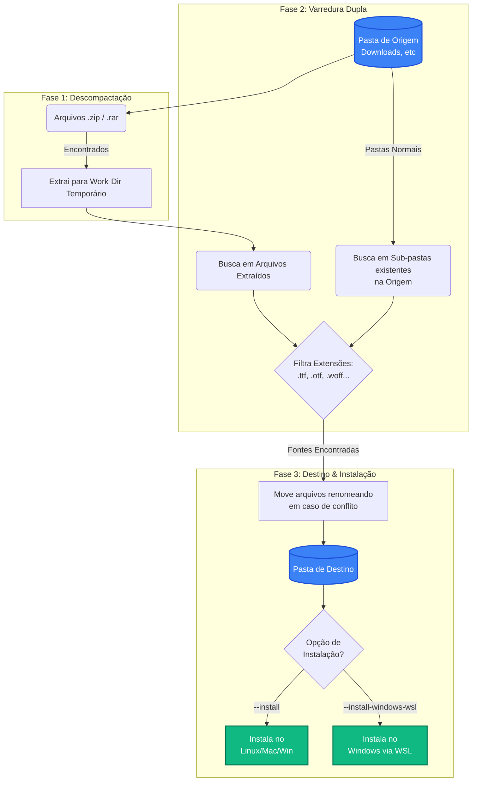

# Extract Tool 🗂️✨

Ferramenta de linha de comando elegante e rápida para **descompactar arquivos**, organizar **fontes tipográficas** e instalá-las automaticamente no seu sistema.

Ideal para designers, desenvolvedores ou utilizadores que baixam muitos pacotes de fontes (ZIP/RAR) e querem um processo zero-fricção para extrair, organizar e instalar tudo de uma só vez.

---

## 🚀 Funcionalidades

1. **Extração Automática**: Descompacta automaticamente `.zip` e `.rar`.
2. **Coleta de Fontes Inteligente**: Não importa em quantas sub-pastas a fonte esteja escondida dentro do ZIP, a ferramenta encontra-a.
3. **Varredura Híbrida**: Além de extrair arquivos compactados, a ferramenta também **varre sub-pastas já existentes** na raiz da pasta de origem em busca de fontes soltas.
4. **Suporte Amplo**: Suporta as principais extensões de fontes: `.ttf`, `.otf`, `.woff`, `.woff2`, `.eot`, `.fon`.
5. **Resolução de Conflitos**: Se duas fontes tiverem o memso nome de arquivo, a ferramenta renomeia-as automaticamente (ex: `font_1.ttf`) sem interromper o processo.
6. **Instalação no Sistema**: Instala as fontes automaticamente no Linux, macOS ou Windows.
7. **Integração WSL**: Executando no Linux (WSL)? A ferramenta consegue injetar as fontes diretamente no seu Windows anfitrião **sem precisar de privilégios de Administrador**.

---

## 🛠️ Requisitos

- [uv](https://docs.astral.sh/uv/) instalado (gerenciador ultrarrápido de Python)
- `unrar` instalado no sistema (necessário apenas se for extrair arquivos RAR):
  ```bash
  # Arch Linux / Manjaro / WSL Arch
  sudo pacman -S unrar

  # Debian / Ubuntu / WSL Ubuntu
  sudo apt install unrar
  ```

## 📦 Instalação

A ferramenta é executada diretamente via `uv` sem necessidade de instalações globais complexas:

```bash
# Sincronizar as dependências locais
uv sync
```

---

## 🖥️ Como Usar

O comando base é simples: origem e destino.

```bash
uv run extract-tool run <ORIGEM> <DESTINO> [OPÇÕES]
```

### 🎯 Opções Disponíveis

| Opção | Descrição |
|---|---|
| `--work-dir PATH` | Define uma pasta intermédia personalizada para extração (padrão: `<origem>/_extracted_tmp`). |
| `--keep-work` | Não apaga a pasta temporária de trabalho no final (útil para debug ou ver outros arquivos do ZIP). |
| `--dry-run` | **Modo simulação:** Mostra exatamente o que seria feito no terminal, mas **não altera nem move nenhum ficheiro**. |
| `--install` | Instala as fontes no sistema operacional nativo (Linux/macOS/Windows) após movê-las. |
| `--install-windows-wsl` | Instala as fontes no **Windows anfitrião** a partir de um terminal Linux/WSL. |

---

## 💡 Exemplos de Uso

**1. O caso de uso mais comum:**
Extrai tudo de `~/Downloads` e organiza os `.ttf`/`.otf` na pasta `~/MinhasFontes`.
```bash
uv run extract-tool run ~/Downloads ~/MinhasFontes
```

**2. Testar antes de executar (Dry-Run):**
```bash
uv run extract-tool run ~/Downloads ~/MinhasFontes --dry-run
```

**3. Extrair, organizar e instalar no sistema atual:**
```bash
uv run extract-tool run ~/Downloads ~/MinhasFontes --install
```

**4. Extrair no Linux/WSL e instalar direto no Windows:**
```bash
uv run extract-tool run ~/Downloads ~/MinhasFontes --install-windows-wsl
```

---

## ⚙️ Como Funciona (O Fluxo de Trabalho)

Abaixo está o pipeline executado pela ferramenta, desde a pasta de origem bruta até à organização final:



### O que acontece nos bastidores de cada passo?

1. **Localiza** todos os `.zip` e `.rar` na pasta `ORIGEM`.
2. **Extrai** com barra de progresso visual (usando a library *Rich*) para uma subpasta oculta `_extracted_tmp`.
3. **Reúne e Filtra:** 
   - Transforma todas as estruturas complexas em uma lista plana de ficheiros.
   - Pega fontes de lá de dentro.
   - Pega fontes de outras sub-pastas antigas que já estavam descompactadas na `ORIGEM`.
4. **Resolução Inteligente:** Joga tudo na pasta `DESTINO`. Se o _PacoteA_ e _PacoteB_ tiverem ambos um `font.ttf`, ele renomeia o segundo para `font_1.ttf` (não perde dados!).
5. **(Opcional) Registo nativo:**
   - **No Linux:** Copia para `~/.local/share/fonts/` e atualiza a cache com `fc-cache -fv`.
   - **No Windows (Nativo ou WSL):** Copia para `%LOCALAPPDATA%\Microsoft\Windows\Fonts`, insere a key no `Regedit (HKCU)` de forma silenciosa e faz um broadcast de alteração de fontes para as apps abertas. Nada de janelas de administrador saltando no ecrã!
6. **Limpa o lixo:** A pasta temporária é apagada, deixando tudo brilhante. ✨
